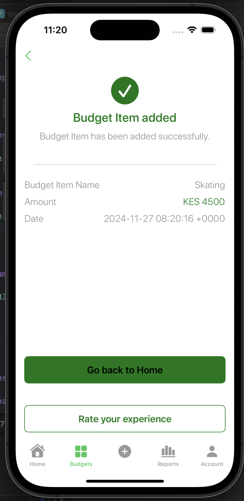

# Budget App
## Features of the app.
1. Add a budget app with item name, currency, price
2. List Budget items

## Screenshots
1. Home Page Screenshot.
 
2. Add Item Page Screenshot.
 
2. Add Item Added successfully Page Screenshot.
 

## Development Features
- Local data persistence: Core Data
- Architecture: MVVM clean architecture and S.O.L.I.D. principles
